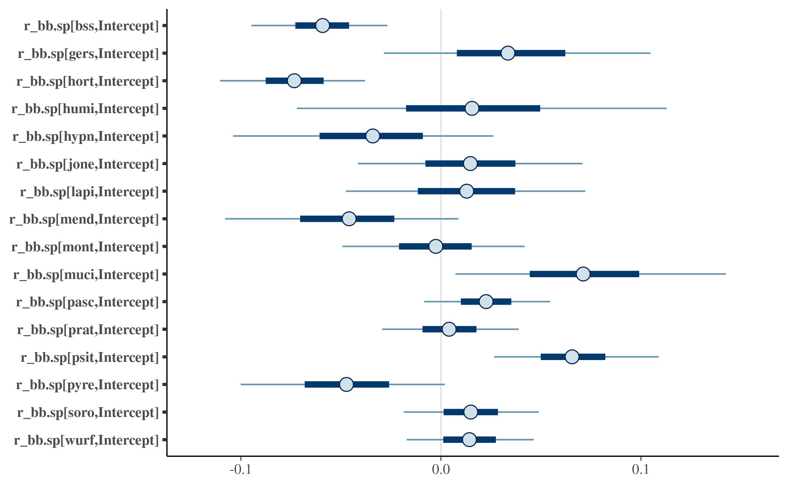

# 1. Introduction

Plant-pollinator networks are characterized by unequal interaction strengths among partners. While the distribution of interaction strengths can be partially explained by the neutral effects of abundance, pollinators exhibit positive and negative biases toward available flora even when interaction strength is conditioned on floral abundance. Taken as a focal phenomenon, the floral biases of pollinators can be interposed between their underlying causal mechanisms and their higher-order significance **(Figure 1)**. From the causal perspective, floral biases can be partitioned into innate and learned components. Both these components depend on interactions between the functional traits of a given pollinator and those of its potential floral hosts, manifest over ecological time scales with respect to learned biases and evolutionary time scales with respect to innate biases. From the vantage of higher-order effects, the floral biases of pollinators contribute to the complex structures observed in plant-pollinator networks, which have consequences for both the ecological function of the network and the fitness of its constituent species. These effects can, in turn, feedback on the causes of bias via their modulation of community composition and biotic interactions.

Bumble bees (Hymenoptera: *Bombus* spp.) are an especially interesting group in which to study floral biases together with their causal mechanisms and downstream effects. On the one hand, bumble bees are exceptionally versatile foragers, and their ability to solve the puzzles posed by complex flower morphologies [@Plowright1984-lc], or indeed by human investigators [@Alem2016-rn; @Loukola2017-bt], renders almost any flower potentially accessible. Even when a gross mismatch between tongue length and corolla depth makes the nectar of a given flower inaccessible by ordinary means, some bumble bee species will resort readily to biting through the base of the flower to “rob” nectar, incidentally making the nectar available to other prospective foragers as well. Flower handling skills are, moreover, socially transmitted, amplifying the plasticity of individual behavior [@Leadbeater2008-rh; @Loukola2017-bt]. Nevertheless, the flexibility of bumble bee foraging is tuned to floral reward, which depends on both the intrinsic reward of a given flower and the searching/learning/handling costs associated with exploiting it. At an evolutionary level, the innate preferences of bumble bees for certain floral traits likely reflect historic associations between floral traits and floral rewards [@Raine2007-nq]. These innate preferences, however, can be modulated or even nullified by patterns of reward learned during foraging [@Kugler1943-uy; Maharaj2019-wm], which depend not only on intrinsic floral properties but also ecological modulators, such as the spatial distribution of floral patches or competition with other bumble bees [@Ishii2013-sm; @Plowright1984-lc; @Sowig1989-ld]. Thus, realized biases in bumble bee foraging are the labile product of bumble bee traits, floral traits, and ecological context. The influence of these biases on interaction network structure has consequences both for plant pollination and bumble bee species coexistence, and these consequences potentially feed back upon the causes of bumble bee foraging bias via the modulation of competition between bumble bees and ultimately via the regulation of community assembly.  <!-- strengthen this sentence with some refs? -->

The topic of floral preference in bumble bees has been approached via both laboratory experimentation [e.g. @Kugler1943-uy; @Raine2007-nq] and observational field study [e.g. Heinrich1976-wc; @Goulson2008-zy]. The former approach enables stronger causal inference with respect to the mechanisms of floral choice, but it suffers all the usual limitations of biological realism associated with experimental control, and the higher-order effects of floral choices on network structure cannot be observed meaningfully under laboratory conditions. Observational field studies, however, tend to be anecdotal in scope, typically describing bumble bee foraging patterns in particular localities, over short time frames, and with limited floristic data to enable a distinction between true foraging bias and the neutral effects of floral abundance [though see @Neumayer1999-il]. The steep elevation gradients of mountain slopes provide an opportunity for more powerful observational study of bumble foraging because they generate broad gradients of floristic and abiotic variation while controlling for confounding effects of geographic variation, such as genotypic differentiation within bumble bee species. When bumble bee visitation in such environments is sampled with sufficient spatial and temporal replication and complemented with quantitative floral surveying, inference can be made regarding both the trait interactions that underpin floral biases and the network structures that result from them. Mountain habitats are also arguably the most relevant places to study bumble bee ecology, since bumble bees are adapted to cool climates, and their global distribution is concentrated in areas of high elevation or high latitude. In such environments, bumble bees tend to dominate the pollinator community, and local flora often depend primarily on bumble bee visitation for pollination. <!-- This paragraph needs to be beefed up a bit, but it at least sketches out the points I want to make. I remember a reference somewhere -- I think in one of the Nordic papers, and I think a recent one -- that suggested that the morphology of alpine flowers has been shaped by selection pressure to attract bumble bees -->


# 2. Methods

## 2.1 Field sampling

The study was conducted in Berchtesgaden National Park (47.55°N, 12.92°E), located in the Northern Limestone Alps of southeast Germany. The landscape is characterized by mountain pastures mainly surrounded by coniferous forests. We selected 25 study sites (60 x 60 m) on mountain pastures at elevations ranging from 641-2032 m above sea level. Fourteen of these pastures are extensively grazed by cattle or sheep, three are mowed for hay production, and eight have been abandoned throughout the last century and are no longer subject to any human management. The sites sampled in this study are the same as those used in a series of previous studies [@Hoiss2012-sn; @Hoiss2012-kr; Hoiss2015-gv], but the data reported here are otherwise independent.

Sampling consisted of repeated visits to each study site at approximately weekly intervals. Samples were only collected on dry days when the air temperature was at least 6°C. During each visit, bumble bees and their activity were recorded during a 50-minute transect walk. Bumblebees observed on or a given flower were counted as floral visitors. Bumble bee queens were identified to species level in the field, whereas workers and males were stored in individually labeled tubes in the freezer for later identification in the laboratory after @Amiet1996-jz. 


## 2.2. Data analysis

Prior to analysis, we aligned each bumble bee visitation sample with corresponding floral survey data. For most samples, floral surveying was conducted jointly with bumble bee visitation observation. In cases where bumble bee visitation was sampled without a joint floral survey, the bumble bee visitation data was paired with the nearest available floral survey data within a maximum distance of 7 days. Bumble bee visitation samples lacking corresponding floral survey data within 7 days were omitted from further analysis. In a few cases where more than one bumble bee visitation date was paired with a given floral survey date, the bumble bee visitation data were pooled. 

### 2.2.1 Modeling cumulative bias 

To quantify cumulative bias per bumble bee species, we used the discrimination (d’) metric of @Bluthgen2006-if, which represents the net deviation of a species’ visitation from the predictions of a null model in which the probability of visitation is purely a function of floral abundance. 

#### 2.2.2.1.1 Model 1: dprime ~

### 2.2.2 Modeling visitation probability as a function of floral morphotype and bumble bee tongue length

#### 2.2.2.1 Model 2: visits.bin ~ prop.flower.cover + bb.sp.abund + (1 | k.type.ss) + (1 | site)

#### 2.2.2.2 Model 3: visits.bin ~ prop.flower.cover + bb.sp.abund + (1 | k.type.ss:pbl.w.class2) + (1 | site)

#### 2.2.2.3 Model 4: Ordination with post-hoc fitting of tongue-length

### 2.2.3 Modeling the relationship between bias and niche relationships 
<!-- I might try to include a plant-centric analysis, too, to see how bias relates to potential competition between plants for BB pollinators. I think it is true to say that if floral resources are not limiting for bees, bee visitation is limiting for flora. -->

#### Model 5: niche_overlap ~ dprime

#### Model 6: Ordination of diet


# 3. Results
## 3.1 Model 1
```{r}

```

## 3.2 Model 2

## 3.3. Model 3

## 3.4 Model 4

## 3.5 Model 5

## 3.6 Model 6

# 4. Discussion

## 4.1 The phenomenon of bias: Cumulative bias and variation across species

## 4.2 The mechanism of bias: Explaining bias by the interaction of flower and bumble bee morphology

## 4.3 The outcome of bias: Linking bias to niche relationships


# Sandbox

constrained by the learning and handling costs associated with available flower morphologies, and these costs are determined principally by the morphological fittedness between bumble bee tongue length and floral corolla depth. Short-tongued bumble bee species exploit deep flowers less efficiently than their long-tongued counterparts (robbing notwithstanding), and long-tongued species are less efficient than short-tongued species when foraging on shallow flowers [@Inouye1980-mv]. 

This phenomenon is formalized by the discrimination (d’) metric of @Bluthgen2006-if, but to avoid conflation with the metric *per se*, we use the term bias in a general sense to describe disproportionality between pollinator visitation and floral abundance.

# 5. References